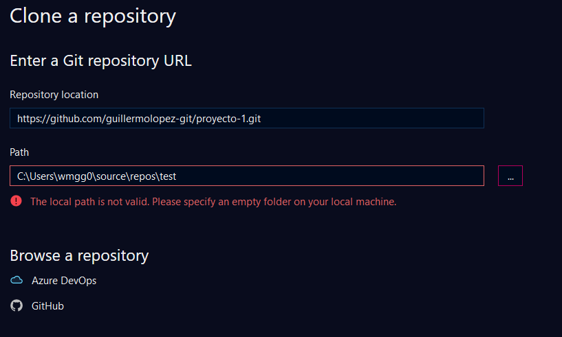
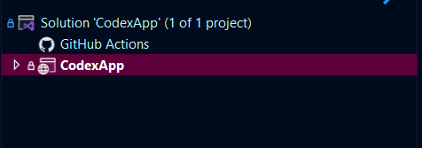

# PROYECTO #1 🧑‍💻

    

**Ingenieria en Sistemas de informacion | 
Programacion III**

**Carnet | Guillermo Ortiz**

## 📄 Documentacion

[Descripcion de las Apis](https://linktodocumentation)

[Informe Técnico](https://linktodocumentation)

## ⚙️ Requisitos

- **Instalar [.NET SDK ](https://dotnet.microsoft.com/en-us/download)**  (en caso de no tenerlo)
  

- **Instalar Visual Studio**
  

- **Instalar las cargas de trabajo ASP.NET y .NET**
  

## 🛠 Como ejecutar el programa...
- **Copiar el URL del Repositorio.**
  
    

- **Abrir Visual Studio y seleccionar "Clonar Repositorio/Clone Repository".**
  
    

- **Pegar el URL y seleccionar la carpeta en la que se guardara el archivo.**

- **Una vez clonado se abrira el proyecto** (si aparece el archivo .sln, doble click sobre el)
    
  

- **Click en la flecha verde y se ejecutara nuestro proyecto**
   
     

